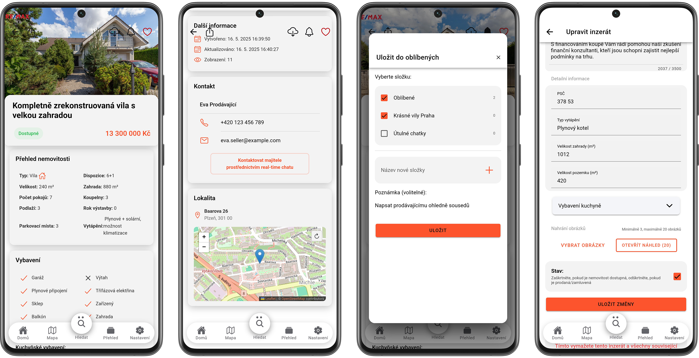
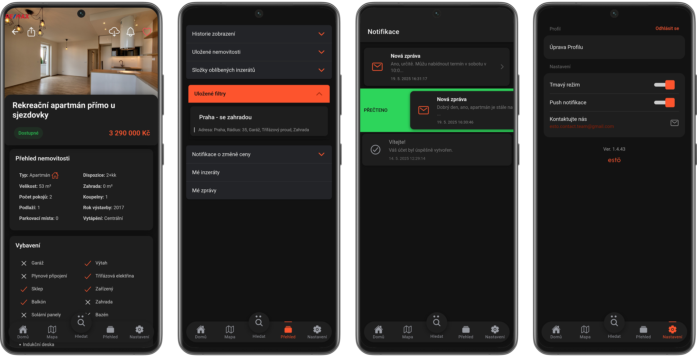

#  - Real Estate Listings Mobile App

Estö is an Android mobile application built for browsing, creating, and managing real estate listings. It provides a user-friendly interface with features like property search, image uploads, favoriting, and map integration. Built with **Ionic React** and **Capacitor**, Estö leverages **TypeScript** for type safety and **Firebase** for backend services, ensuring a robust and secure experience.

## Features

- **Home Screen with Swiper**: Browse featured listings with an intuitive [swiper](https://github.com/nolimits4web/swiper) interface.
- **Create Listings**: Easily create new property listings.
- **Drag-and-Drop Image Sorting**: Utilizes a `ImageUploader.tsx` component with drag-and-drop powered by [dnd-kit](https://github.com/clauderic/dnd-kit) for sorting images.
- **Property Details**: View detailed information about properties with an option to favorite listings into folders, enable Push Notifications or download for offline viewing.
- **Edit Property**: Modify existing listings with an edit form.
- **Leaflet Map Integration**: Visualize all listings on an interactive map, with filtering based on search results.
- **Search Functionality**: Search for properties and view results, with seamless map integration.
- **Dark Mode**: A sleek dark mode interface for enhanced user experience.
- **Real-Time Chat**: Built-in messaging system using Firestore for instant communication between users.
- **Notification Center**: Stay updated with listing-related notifications and real-time chat messages.
- **Settings**: Customize app preferences.
- **Secure Backend**: Leverages Firebase Authentication, Firestore Rules, and client-side validation for security.

## Screenshots

Below are screenshots showcasing Estö's features.

1. **Main Features**  
   

   - **Home Screen**: Page showcasing trending and newest listings, with buttons to notifications center and create form.
   - **Create Form**: A form for adding new property listings.
   - **ImageUploader.tsx**: A custom component using [dnd-kit](https://github.com/clauderic/dnd-kit) for drag-and-drop image sorting.

2. **Property Management**  
   

   - **Property Details (1)**: Detailed view of the property.
   - **Property Details (2)**: Additional details showcasing the contact (with the ability to engage in a chat with the owner) and a minimap.
   - **Favorite Modal**: A modal for adding listings to favorite folders, adding new folders and adding notes to favorite listings.
   - **Edit Property**: A form to edit existing properties.

3. **Map and Search**  
   

   - **Leaflet Map**: Displays all listings on an interactive map.
   - **Search Screen**: Interface for entering search criteria.
   - **Search Results**: Lists properties matching the search query.
   - **Filtered Map**: Map view showing only the listing selected from search results.

4. **Dark Mode**  
   

   - **Property Details**: Property view in dark theme.
   - **Overview Section**: User's overview, where he can find his history, downloaded properties, favorite folders, saved filters, properties with notifications enabled. But also his listings and chats he has engaged in.
   - **Notification Center**: Displays app notifications.
   - **Settings**: User preferences and app configuration.

## Technologies Used

- **Ionic React**: For building a cross-platform mobile UI.
- **Capacitor**: For native Android integration.
- **TypeScript**: Ensures type-safe code.
- **Firebase**:
  - **Cloud Functions**: Backend logic and automation.
  - **Firestore**: Real-time database for listings.
  - **Authentication**: Secure user login and management.
  - **Storage**: For storing property images.
- **Security**: Firestore Rules and client-side validation.
- **Leaflet**: Interactive maps for property visualization.
- **React Hooks & Components**: Modular and reusable UI logic.
- **Services**: Encapsulated business logic for interacting with Firebase.

## Security

Estö ensures data security through:

- **Firestore Security Rules**: Restrict unauthorized access to the database.
- **Client-Side Validation**: Prevents invalid data submissions.
- **Firebase Authentication**: Secure user management.

## License

This project is licensed under the MIT License. See the [LICENSE](LICENSE) file for details.
